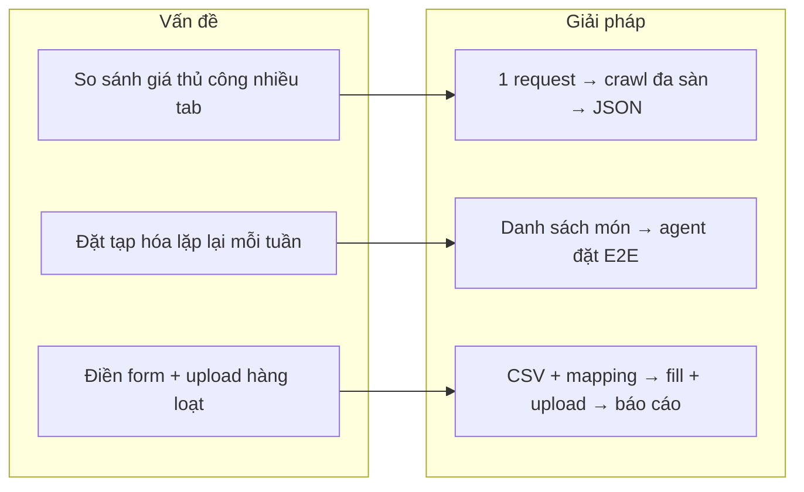
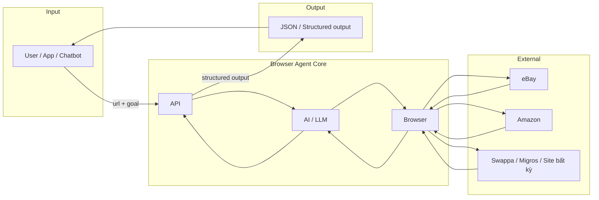
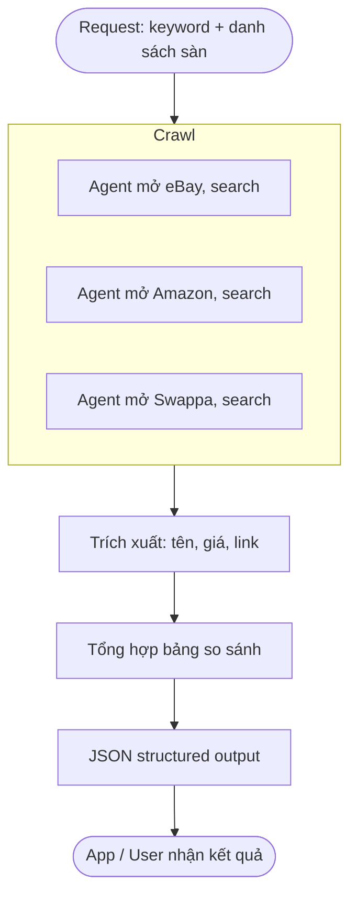
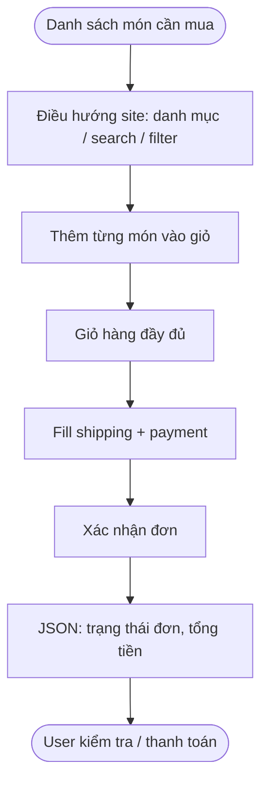
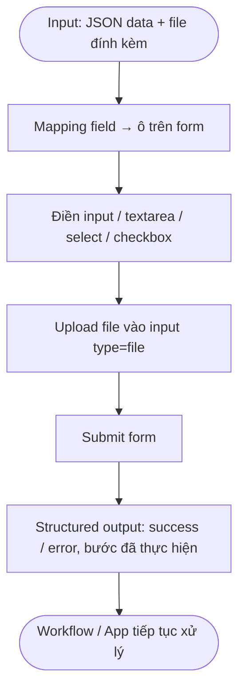
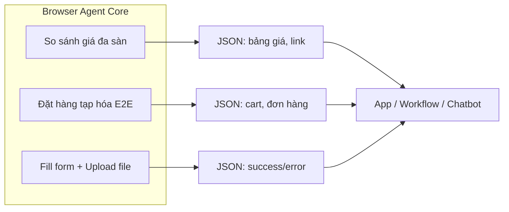
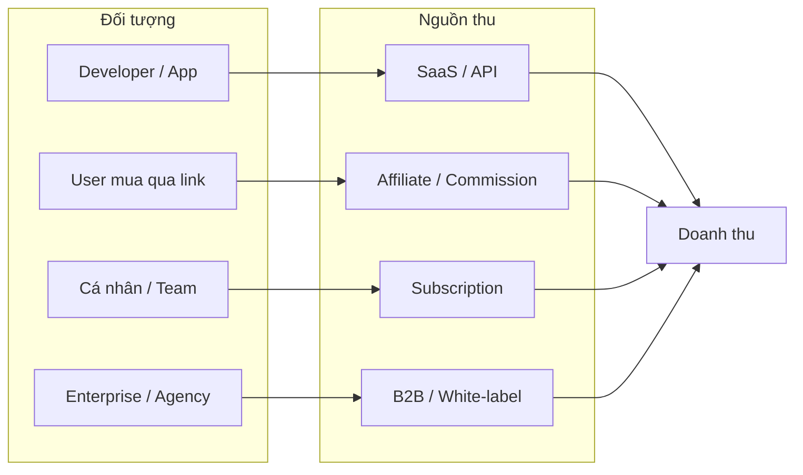
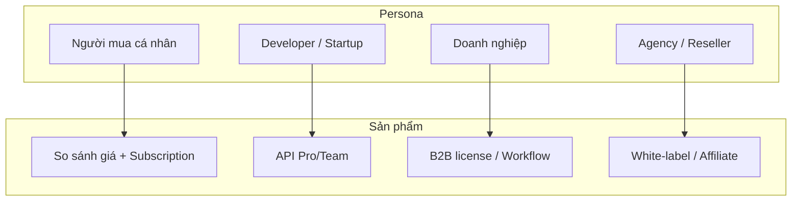
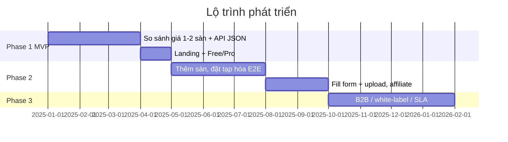

## Tên sản phẩm & elevator pitch

**Browser Agent Core** — API + browser agent điều khiển bằng AI: so sánh giá đa sàn, đặt hàng tạp hóa end-to-end, fill form + upload file. Mô tả mục tiêu bằng ngôn ngữ tự nhiên (hoặc danh sách cần làm), hệ thống tự thực hiện và trả **structured output** (JSON) — không cần viết script hay maintain selector khi site đổi.

*Dùng cho slide mở đầu / one-liner khi giới thiệu.*

---

## Tại sao lại có ý tưởng này

Mua sắm và thao tác trên web ngày càng nhiều nhưng người dùng phải tự mở từng sàn, gõ từ khóa, so sánh giá thủ công, lặp lại đặt hàng tạp hóa mỗi tuần, hoặc điền điền lại các form giống nhau (đăng ký, nộp đơn, feedback). Các công cụ so sánh giá có sẵn thường chỉ gắn với một vài đối tác, khó mở rộng; automation script thì dễ gãy khi UI thay đổi và cần người biết code. Ý tưởng dự án là dùng **AI điều khiển browser** theo mục tiêu bằng ngôn ngữ tự nhiên: một hệ thống vừa **crawl nhiều sàn** trả **structured output**, vừa **thực hiện flow đặt hàng end-to-end** hoặc **fill form + upload file** thay cho con người, dễ mở rộng sàn và trang web mới mà không phụ thuộc vào từng layout cố định.

---

## Nỗi khổ của những người cần các tính năng này

- **So sánh giá đa sàn:** Phải mở từng tab eBay, Amazon, Swappa (và các sàn khác), gõ lại cùng một từ khóa, lần lượt xem từng trang, copy giá và link vào Excel hoặc ghi chú — tốn thời gian, dễ sót, khó so sánh nhanh “sàn nào rẻ nhất” hoặc “cùng sản phẩm giá chênh bao nhiêu”. Công cụ so sánh giá thường chỉ hỗ trợ vài sàn và ít khi cho **structured data (JSON)** để tự tích hợp vào app hoặc workflow.
- **Đặt hàng tạp hóa online:** Mỗi tuần phải vào app/site, tìm từng món trong danh sách, thêm vào giỏ, điền địa chỉ và thanh toán — công việc lặp đi lặp lại, nhàm chán. Người bận rộn, người cao tuổi hoặc người cần hỗ trợ (đặt hộ) muốn chỉ cần đưa “danh sách mua” và để hệ thống chạy **end-to-end**, nhưng hiện phần lớn vẫn phải thao tác tay.
- **Điền form và upload file:** Đăng ký dịch vụ, nộp đơn, gửi feedback có đính kèm thường yêu cầu điền rất nhiều ô giống nhau trên nhiều trang; upload file lại phải bấm chọn từng file. Làm hàng chục đơn hoặc đăng ký hàng loạt thì rất mệt, dễ nhầm dữ liệu; doanh nghiệp muốn automation nhưng **RPA** truyền thống đắt và khó maintain khi **UI** web đổi.

Dự án hướng tới giảm những nỗi khổ đó: **một lần mô tả mục tiêu (hoặc danh sách cần làm)**, hệ thống tự **crawl**, so sánh, đặt hàng hoặc **fill form + upload file** và trả **structured output**.

### Sơ đồ: Vấn đề → Giải pháp

---

# Đặc tả dự án – Browser Agent

---

## Tổng quan

Dự án phát triển **browser agent điều khiển bằng AI** với ba nhóm tính năng chính: so sánh giá đa sàn (multi-site crawl + structured output), đặt hàng tạp hóa online **end-to-end**, và **fill form** kèm **upload file**. Tài liệu này mô tả phạm vi và tính năng dự án (tiếng Việt, từ khóa công nghệ dùng tiếng Anh).

### Sơ đồ kiến trúc tổng thể

*Luồng: User/App gửi mục tiêu (url + goal) → API → AI quyết định hành động → Browser thao tác trên các site → thu thập dữ liệu → trả JSON cho user.*

---

## Tính năng 1: So sánh giá / Tìm kiếm sản phẩm đa sàn

**Mục tiêu:** Tìm kiếm thông tin sản phẩm và so sánh giá trên nhiều sàn thương mại điện tử (eBay, Amazon, Swappa).

**Tính năng:**

- **Multi-site crawl:** Agent duyệt đồng thời hoặc tuần tự nhiều site (eBay, Amazon, Swappa) theo từ khóa / tên sản phẩm.
- **Structured output:** Kết quả trả về **JSON**: tên sản phẩm, giá, link, nguồn sàn, có thể thêm điều kiện (mới/cũ, khu vực).
- **So sánh giá:** Tổng hợp kết quả từ các sàn thành một bảng/báo cáo so sánh (rẻ nhất, theo sàn, theo điều kiện).
- **Mở rộng:** Có thể thêm sàn khác (Shopee, Lazada, Tiki, v.v.) theo cùng mô hình; dễ scale thêm **source** mới.

**Đối tượng sử dụng:** Người mua muốn tìm giá tốt; công cụ so sánh giá; tích hợp vào app / chatbot mua sắm.

### Sơ đồ flow: So sánh giá đa sàn

---

## Tính năng 2: Đặt hàng tạp hóa online end-to-end (Shopping)

**Mục tiêu:** Tự động đặt hàng tạp hóa online từ đầu đến cuối trên các site bán tạp hóa (ví dụ: Migros hoặc sàn tương tự).

**Tính năng:**

- **Multi-site crawl / chuẩn bị:** Hỗ trợ điều hướng nhiều trang (danh mục, search, filter) để tìm sản phẩm cần mua.
- **Structured output:** Trích xuất danh sách sản phẩm, giá, số lượng, tổng tiền theo format **JSON** để tích hợp với bước đặt hàng hoặc **workflow**.
- **Flow đặt hàng end-to-end:** Từ danh sách mua (cart) → thêm vào giỏ trên web → fill thông tin shipping/payment (nếu có trong phạm vi) → xác nhận đơn (theo chính sách từng site).
- **Tích hợp với so sánh:** Có thể kết hợp với Tính năng 1 (so sánh giá tạp hóa giữa các sàn) rồi chọn sàn và thực hiện đặt hàng.

**Đối tượng sử dụng:** Cá nhân đặt hàng tạp hóa định kỳ; dịch vụ đặt hàng hộ; demo **automation** cho retail.

### Sơ đồ flow: Đặt hàng tạp hóa end-to-end

---

## Tính năng 3: Điền form và upload file

**Mục tiêu:** Tự động **fill form** trên web và **upload file** theo dữ liệu cho trước.

**Tính năng:**

- **Fill form:** Nhận dữ liệu (**JSON** / key-value hoặc mapping field) và điền vào các ô **input**, **textarea**, **select**, **checkbox**, **radio** trên trang; hỗ trợ form nhiều bước (**wizard**).
- **Upload file:** Chọn file từ đường dẫn hoặc nguồn được cung cấp và thực hiện upload vào **input** `type="file"` (hoặc drag-and-drop nếu UI hỗ trợ).
- **Kết hợp:** Một **request** có thể vừa fill form vừa upload file (vd: form đăng ký + đính kèm CV).
- **Structured output:** Trả về trạng thái (success/error), các bước đã thực hiện, thông báo lỗi từ trang (nếu bắt được) để tích hợp vào **workflow**.

**Đối tượng sử dụng:** Tự động đăng ký dịch vụ, nộp đơn, gửi feedback có đính kèm; **RPA** nhẹ; tích hợp với quy trình nội bộ.

### Sơ đồ flow: Fill form + upload file

---

## Tóm tắt phạm vi dự án

| Nhóm tính năng | Mô tả ngắn |
|----------------|------------|
| **So sánh giá đa sàn** | **Multi-site crawl** (eBay, Amazon, Swappa, mở rộng); **structured output** (JSON) để so sánh giá. |
| **Đặt hàng tạp hóa** | **Crawl** / điều hướng site tạp hóa (vd Migros), **structured output** giỏ hàng, flow đặt hàng **end-to-end**. |
| **Điền form & upload file** | **Fill form** theo dữ liệu cho trước + **upload file**; **structured output** để báo kết quả, tích hợp **workflow**. |

Dự án phát triển lại theo ba hướng trên; tài liệu kỹ thuật chi tiết (**API**, **flow**, **stack**) sẽ được bổ sung trong các tài liệu riêng.

### Sơ đồ ba nhóm tính năng (phạm vi)

---

## Ưu nhược điểm của dự án

### Ưu điểm

- **Một nền tảng, nhiều use case:** Cùng một **browser agent** + AI có thể phục vụ so sánh giá, đặt hàng tạp hóa, fill form & upload file; giảm chi phí phát triển và vận hành so với nhiều tool rời rạc.
- **Mô tả bằng ngôn ngữ tự nhiên:** Người dùng (hoặc hệ thống gọi **API**) chỉ cần mô tả mục tiêu, không cần viết **script** hay **selector** cố định; dễ thay đổi flow khi thêm sàn hoặc thay đổi quy trình.
- **Structured output dễ tích hợp:** Kết quả trả về **JSON** chuẩn, dễ đưa vào **workflow**, **dashboard**, **chatbot** hoặc **downstream** xử lý tiếp.
- **Dễ mở rộng nguồn:** Thêm sàn mới (eBay, Amazon, Swappa, Shopee, Migros, …) chủ yếu qua cấu hình và prompt, không phụ thuộc hoàn toàn vào **layout** từng site — AI thích ứng với **UI** khác nhau trong giới hạn.
- **Giảm RPA cứng:** So với **RPA** truyền thống (record/playback, selector cố định), agent linh hoạt hơn khi trang đổi **UI**, ít phải maintain **script** khi site update.

### Nhược điểm

- **Phụ thuộc AI và chi phí token:** Chất lượng phụ thuộc model (GPT, Gemini, …); mỗi bước đều gọi **LLM** → tốn **token**, chi phí vận hành tăng khi **scale** số request hoặc số bước mỗi task.
- **Độ ổn định theo từng site:** Mỗi sàn có **layout**, **anti-bot**, **CAPTCHA** khác nhau; agent có thể thất bại hoặc cần **retry** / xử lý đặc thù (cookie consent, login, 2FA).
- **Giới hạn pháp lý và điều khoản:** Crawl và tự động đặt hàng / điền form phải tuân thủ **ToS** của từng site và quy định pháp luật; một số sàn cấm **scraping** hoặc **automation**.
- **Độ trễ và tài nguyên:** Mỗi task có thể mất nhiều bước (crawl → click → fill → submit), thời gian phản hồi dài hơn **API** tĩnh; chạy **browser** tốn RAM/CPU, **scale** ngang cần quản lý **concurrency** và **timeout**.
- **Cần monitoring và fallback:** Khi AI chọn sai **element** hoặc trang thay đổi, cần **logging**, **alert** và quy trình xử lý lỗi (retry, human-in-the-loop) để đảm bảo độ tin cậy.

---

## Các hướng kiếm tiền từ dự án

### 1. SaaS / API trả phí theo usage

- Bán **API** (so sánh giá, đặt hàng, fill form) theo **request** hoặc **token**: gói free (vài trăm request/tháng), gói Pro/Team (giới hạn cao hơn, **rate limit** cao), gói Enterprise (SLA, **dedicated**).
- Thu phí theo **usage** (số lần gọi **endpoint**, số bước mỗi task, số site crawl) — phù hợp startup, developer, team nhỏ cần tích hợp nhanh mà không tự host.

### 2. Affiliate & hoa hồng chuyển đổi

- **So sánh giá:** Khi user click qua sàn mua hàng từ kết quả so sánh, nhận **affiliate** từ sàn (Amazon Associates, eBay Partner Network, …). Doanh thu = % hoa hồng trên đơn.
- **Đặt hàng tạp hóa:** Hợp tác sàn tạp hóa (Migros, các siêu thị online) — nhận **commission** khi đơn hàng được tạo qua **flow** của mình (deep link, **tracking**).
- Có thể kết hợp: app/website so sánh giá hoặc "đặt hộ" miễn phí cho user, kiếm tiền từ **affiliate** thay vì thu phí trực tiếp.

### 3. Subscription theo đối tượng

- **Cá nhân:** Gói hàng tháng/năm — "X lần so sánh giá + Y đơn tạp hóa + Z form" mỗi tháng; phù hợp người đặt hàng định kỳ, người tìm giá rẻ.
- **Doanh nghiệp / team:** Gói theo seat hoặc theo **workflow**: RPA nhẹ (fill form, upload file hàng loạt), tích hợp **CRM** / **ERP**; giá cao hơn, đi kèm **support**, **onboarding**.
- **Agency / reseller:** Gói **white-label** hoặc **API** volume để họ bán lại cho khách (công cụ so sánh giá, dịch vụ đặt hàng hộ, automation form).

### 4. B2B & tích hợp theo dự án

- Bán **license** hoặc **custom integration** cho công ty retail, logistics, hỗ trợ khách hàng: so sánh giá nội bộ, đặt hàng tạp hóa cho nhân viên/công ty, tự động nộp đơn/điền form theo batch.
- Thu phí **one-time** (triển khai, training) + **recurring** (maintain, thêm sàn, thêm **use case**); có thể **revenue share** nếu khách dùng để bán dịch vụ cho end-user.

### 5. Data & báo cáo (nếu tuân thủ pháp luật & ToS)

- **Aggregate** dữ liệu giá (không chi tiết cá nhân) từ **crawl** so sánh → bán **report**, **trend** giá theo ngành/ngành hàng cho doanh nghiệp, **market research**.
- Chỉ áp dụng khi **ToS** và luật cho phép; có thể **anonymize**, chỉ bán insight tổng hợp.

### 6. White-label & hợp tác nền tảng

- Cung cấp **white-label** cho app mua sắm, **super app**, **banking** (tích hợp "so sánh giá" hoặc "đặt hàng tạp hóa" trong app của họ); thu phí **license** hoặc % doanh thu tính năng đó.
- Hợp tác với **marketplace**, **price comparison** hiện có: họ dùng **API** của mình để bổ sung sàn/source, mình thu phí **API** hoặc **revenue share**.

---

**Tóm tắt:** Có thể kết hợp nhiều kênh — **SaaS/API** + **affiliate** + **subscription** + **B2B** — tùy giai đoạn và đối tượng (B2C vs B2B). Ưu tiên **product-led** (dùng thử so sánh giá / fill form miễn phí) để tạo **funnel**, sau đó upsell gói trả phí hoặc **enterprise**.

### Sơ đồ luồng kiếm tiền

---

## Đối tượng khách hàng (persona) — cho thuyết trình

| Persona | Nhu cầu chính | Sản phẩm đáp ứng |
|--------|----------------|-------------------|
| **Người mua cá nhân** | Tìm giá rẻ, đặt tạp hóa định kỳ, không muốn mở từng sàn | So sánh giá 1 lần; đặt hàng từ danh sách; subscription cá nhân |
| **Developer / startup** | Tích hợp so sánh giá hoặc automation vào app, không muốn tự crawl/maintain | API theo request; structured output; gói Pro/Team |
| **Doanh nghiệp (retail, support, ops)** | So sánh giá nội bộ, đặt hàng hộ, fill form hàng loạt | B2B license; workflow integration; RPA nhẹ |
| **Agency / reseller** | Bán lại công cụ so sánh giá hoặc dịch vụ đặt hộ cho khách | White-label; API volume; affiliate |

*Dùng để trả lời "Ai mua?" và "Họ trả tiền cho cái gì?".*

### Sơ đồ persona → sản phẩm

---

## Kịch bản demo / use case ngắn — cho thuyết trình

1. **So sánh giá:** "Anh A cần mua iPhone cũ, mở eBay + Amazon + Swappa rất mệt → gửi 1 request: keyword + 3 sàn → nhận JSON bảng giá + link, click qua mua, mình nhận affiliate."
2. **Đặt hàng tạp hóa:** "Chị B mỗi tuần đặt tạp hóa trên Migros, lặp lại 30 phút → gửi danh sách món → agent thêm giỏ, điền địa chỉ, xác nhận đơn → chị chỉ kiểm tra và thanh toán."
3. **Fill form:** "Công ty C nộp 50 đơn dự tuyển, mỗi đơn 20 ô giống nhau → upload CSV + mapping → agent điền từng form + đính kèm file, trả báo cáo success/error."

*Dùng để kể chuyện cụ thể khi trình bày.*

---

## So với đối thủ / competitive landscape

| So với | Điểm khác của Browser Agent Core |
|--------|-----------------------------------|
| **Công cụ so sánh giá truyền thống** (Google Shopping, trang so sánh cố định) | Ít sàn, ít khi cho **API/JSON**; mình crawl đa sàn, **structured output**, dễ thêm source mới. |
| **RPA truyền thống** (UiPath, Automation Anywhere, script Selenium) | **Selector** cố định, UI đổi là gãy; mình dùng AI + ngôn ngữ tự nhiên, linh hoạt hơn, ít maintain. |
| **Browser automation + AI** (browser-use, Bolt.new, …) | Nhiều tool open-source / generic; mình tập trung 3 use case (so sánh giá, đặt tạp hóa, form+file) và **structured output** sẵn để tích hợp **workflow** / kiếm tiền (affiliate, SaaS). |

*Dùng để trả lời "Khác gì các giải pháp có sẵn?".*

---

## Roadmap / lộ trình (gợi ý cho thuyết trình)

- **Phase 1 (MVP):** So sánh giá 1–2 sàn (vd eBay, Amazon); **API** trả JSON; landing + gói free/Pro.
- **Phase 2:** Thêm sàn (Swappa, Shopee, …); flow đặt hàng tạp hóa end-to-end (1 site); fill form + upload file; affiliate + subscription.
- **Phase 3:** Đa sàn tạp hóa; B2B / white-label; **monitoring**, **retry**, **SLA**; data/report (nếu tuân ToS).

*Giúp người nghe hình dung bước đi và ưu tiên.*

### Sơ đồ roadmap (timeline)

*Có thể chỉnh lại mốc thời gian theo thực tế.*

---

## Call to action — sau khi thuyết trình

- **Investor / đối tác:** Xin feedback về **positioning** và roadmap; mời thử **API** hoặc bản demo.
- **Khách hàng tiềm năng:** Đăng ký **beta** / dùng thử so sánh giá hoặc fill form miễn phí; liên hệ nếu cần **enterprise** hoặc **white-label**.
- **Developer:** Thử **API**, đọc docs; contribute hoặc tích hợp vào **workflow** của mình.

*Kết thúc slide bằng 1 CTA rõ ràng (link đăng ký, email, form liên hệ).*
